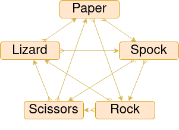

# Rock, Paper, Scissors, Lizard, Spock

Your final task is to create a similar version of the game 'Rock, Paper, Scissors'. It's called 'Rock, Paper, Scissors, Lizard, Spock'.

## General Instructions

- Choose any programming language of your choice and add your own customizations.
- We will evaluate whether the task conditions are met, as well as code quality and code readability.
- This task has three difficulty levels. To achieve the highest score, complete all levels. However, it is mandatory to complete only the first level.

**Deadline: 26 JULY 2023**

Send your solution to akademija@mitigate.dev.

## Game Rules

The following are the game rules:

- Rock crushes Scissors.
- Scissors cuts Paper.
- Paper covers Rock.
- Rock crushes Lizard.
- Lizard poisons Spock.
- Spock smashes Scissors.
- Scissors decapitates Lizard.
- Lizard eats Paper.
- Paper disproves Spock.
- Spock vaporizes Rock.

## Level 1

- Create a console game.
- Play three rounds against the computer.
- Input your choice of words (or another type of input).
- After three rounds, print out in the console who the winner is.

## Level 2

- There are predefined 3 computer players.
- Each player has a funny name which should be displayed during gameplay.
- Play three rounds against each computer player.
- To become the winner, you need to defeat all players.

## Level 3

- You can choose the number of computer players (from 1 up to 9).
- You can choose the number of rounds (from 1 up to 5).
- Each player should play against every other player, including computer vs. computer matches.
- Print out the results for all players in any form you like.
- To become the winner, you need to have the highest victory count.
